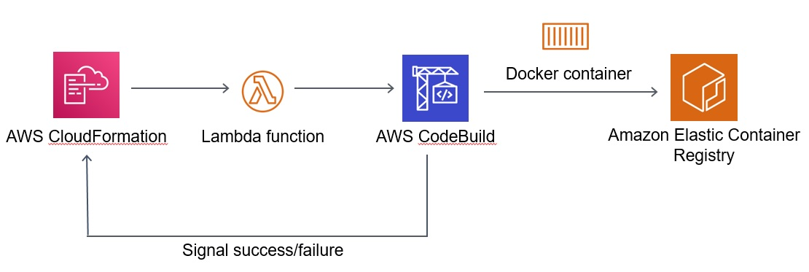

## Build container images using AWS CloudFormation

In this example I demonstrate using Custom Lambda-backed resource to run a CodeBuild project, creating a Docker container image and uploading it to Amazon Elastic Container Regsitry, using Cloudformation.

